# 申归途 - 用户帮助手册

---

## 目录

- [1. 应用简介](#1-应用简介)
- [2. 快速入门](#2-快速入门)
- [3. 页面详细说明](#3-页面详细说明)
  - [3.1 欢迎页](#31-欢迎页)
  - [3.2 仪表盘（主页）](#32-仪表盘主页)
  - [3.3 每日签到](#33-每日签到)
  - [3.4 用药管理](#34-用药管理)
    - [3.4.1 药物知识](#341-药物知识)
    - [3.4.2 副作用追踪](#342-副作用追踪)
    - [3.4.3 药物-情绪联动](#343-药物-情绪联动)
    - [3.4.4 减药导航](#344-减药导航)
  - [3.5 服务中心](#35-服务中心)
    - [3.5.1 家属支持](#351-家属支持)
    - [3.5.2 社会重建](#352-社会重建)
  - [3.6 危机干预](#36-危机干预)
  - [3.7 心理干预课程](#37-心理干预课程)
  - [3.8 WRAP康复计划](#38-wrap康复计划)
- [4. 常见问题（FAQ）](#4-常见问题faq)
- [5. 紧急联系信息](#5-紧急联系信息)

---

## 1. 应用简介

### 申归途是什么

「申归途」是一款专为抑郁症康复期用户设计的复发预防支持工具。应用名称取"重返归途"之意，寓意陪伴每一位正在康复路上的朋友，稳步前行、远离复发。我们相信，科学的自我管理与专业医疗相结合，能够帮助您更好地掌控自己的康复进程。

### 核心功能概览

申归途围绕康复全流程，提供五大核心功能模块：

- **每日追踪**：通过六维度自评量表，帮助您每日记录身心状态，形成可量化的康复趋势数据。
- **用药管理**：完整的药物管理工具，涵盖服药记录、副作用追踪、药物-情绪联动分析及减药导航。
- **危机守护**：一键接入心理援助热线，内置呼吸放松练习，在关键时刻为您提供即时支持。
- **心理课程**：整合CBT、MBCT、WRAP、ACT四大循证疗法课程，支持分级学习与进度追踪。
- **康复计划**：基于WRAP框架的个人康复行动计划编辑器，帮助您建立系统化的自我管理方案。

### 适用人群

本应用主要面向以下用户：

- 已确诊抑郁症且处于康复期的患者
- 正在接受药物治疗并希望提升用药管理能力的用户
- 希望通过科学方法预防复发的康复者
- 患者的家属及照护者（可通过家属支持模块获取指导）

### 免责声明

**申归途是一款辅助支持工具，不能替代专业医疗诊断与治疗。** 应用中的所有内容仅供参考，不构成医疗建议。用药调整（包括减药、停药）必须在专业医生指导下进行。如您正处于危机状态，请立即拨打急救电话或心理援助热线。

---

## 2. 快速入门

### 首次使用流程

1. 打开应用，进入欢迎页，了解应用核心功能。
2. 点击"开始使用"按钮，进入主页仪表盘。
3. 建议先完成一次**每日签到**，记录当前身心状态。
4. 如正在服药，前往**用药管理**添加常用药物。
5. 浏览**心理干预课程**，选择适合的课程开始学习。
6. 根据个人需要，编辑**WRAP康复计划**，建立专属康复方案。

### 底部导航栏说明

应用底部设有四个主要导航入口：

| 导航项 | 功能说明 |
|--------|----------|
| **首页** | 仪表盘总览，包含风险评分、签到入口、用药依从率、趋势图等核心数据 |
| **疗愈** | 心理干预课程中心，提供CBT、MBCT、WRAP、ACT等循证疗法课程 |
| **服务** | 服务中心，整合医院、热线、社区、医保、家属支持、社会重建等资源 |
| **成长** | 个人康复计划（WRAP）编辑器，管理您的康复行动计划 |

### 紧急求助按钮说明

在应用多个页面中，您会看到一个醒目的**紧急求助按钮**（通常为红色电话图标）。点击该按钮可一键拨打心理援助热线。无论您在应用的哪个页面，都可以随时使用此功能。请记住，寻求帮助是勇敢的表现。

---

## 3. 页面详细说明

### 3.1 欢迎页

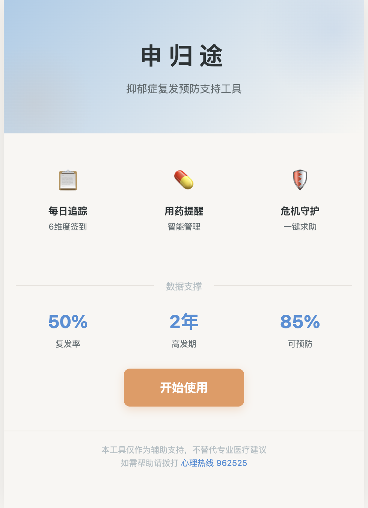

欢迎页是您打开申归途后看到的第一个页面，旨在帮助您快速了解应用的核心价值。

**功能说明：**

欢迎页展示了申归途的品牌形象与核心理念，包括应用名称、品牌标识和设计风格。页面以简洁温暖的方式呈现三大核心亮点——科学追踪、专业课程、危机守护，让您对应用功能一目了然。此外，页面还展示了用户数据统计（如累计签到天数、活跃用户数等），传递康复路上的陪伴感。页面底部设有"开始使用"按钮，引导您进入应用主页。

**操作步骤：**

1. 浏览页面内容，了解申归途的核心功能与理念。
2. 点击页面底部的 **"开始使用"** 按钮，进入主页仪表盘。

---

### 3.2 仪表盘（主页）

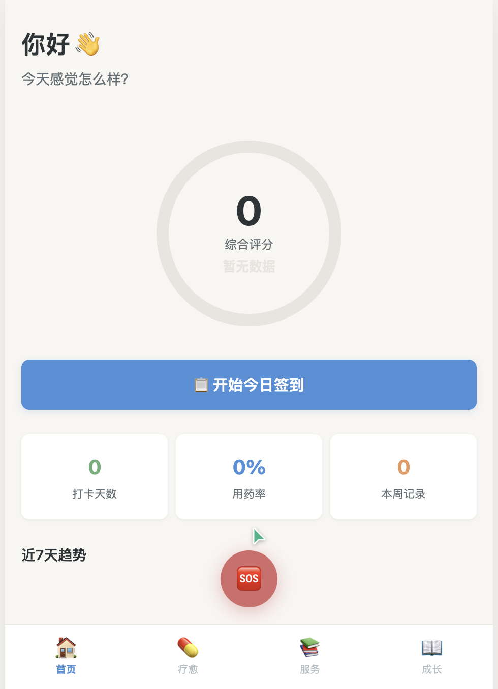

仪表盘是申归途的核心枢纽，集中展示您的康复状态全景。

**功能说明：**

仪表盘顶部以直观的仪表盘形式展示您的**综合风险评分**，帮助您快速了解当前身心状态。评分基于您近期的签到数据自动计算，绿色表示状态良好，黄色提示需要关注，红色则建议及时寻求专业帮助。页面中部提供**每日签到入口**，方便您快速完成当日自评。下方展示**用药依从率**卡片和**近7天趋势图**，让您清晰看到康复轨迹。页面底部设有**WRAP计划快捷入口**，方便随时编辑康复方案。

**操作步骤：**

1. 打开应用后默认进入仪表盘，查看顶部**风险评分**。
2. 点击签到卡片区域，进入**每日签到**页面。
3. 查看**用药依从率**，了解近期服药情况。
4. 浏览**近7天趋势图**，观察身心状态变化趋势。
5. 点击WRAP计划入口，进入**康复计划编辑器**。

---

### 3.3 每日签到

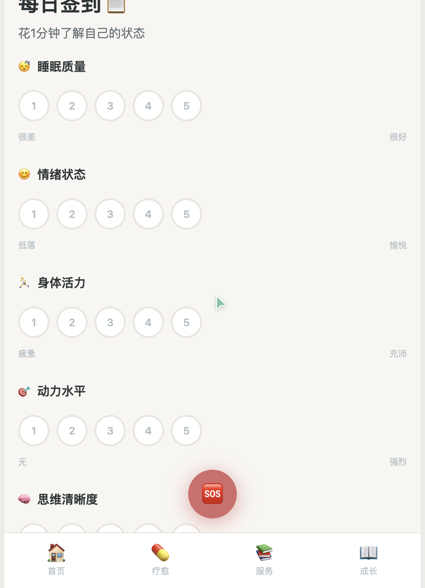

每日签到是申归途最核心的日常功能，帮助您持续追踪身心状态。

**功能说明：**

签到页面采用六维度自评量表，涵盖**睡眠质量、情绪状态、身体活力、动力水平、思维清晰度、社交意愿**六个方面。每个维度使用1-5分评分制（1分代表非常差，5分代表非常好），您可以根据当天的实际感受进行评分。系统会根据评分数据自动生成趋势分析，帮助您和医生更好地了解康复进展。签到还支持填写备注，记录当天的特殊情况或心情随笔。

**操作步骤：**

1. 从仪表盘点击签到入口，或通过底部导航进入首页后点击签到。
2. 依次对六个维度进行评分，点击对应的分数按钮（1-5分）。
3. （选填）在备注栏中输入当天的特殊情况或感受。
4. 确认所有评分后，点击 **"提交"** 按钮完成签到。
5. 提交成功后，系统会显示签到完成提示并返回仪表盘。

**常见问题：**

- **忘记签到怎么办？** 系统允许补签，您可以在次日或之后补填前一天的签到记录。
- **评分标准是什么？** 评分完全基于主观感受，没有对错之分，请根据当天真实状态选择。

---

### 3.4 用药管理

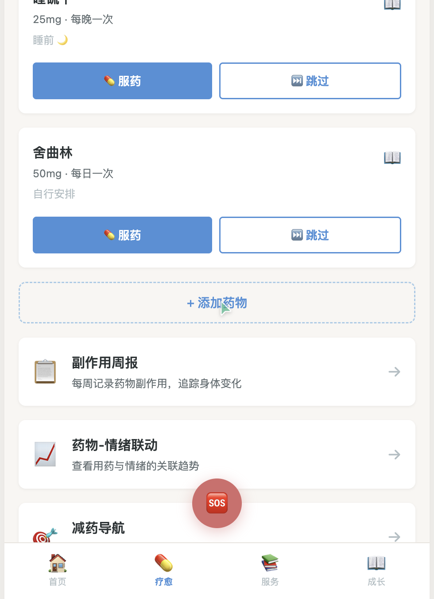

用药管理模块为您提供全方位的药物治疗支持工具。

**功能说明：**

用药管理页面以清晰的列表形式展示您正在使用的所有药物信息。每条药物记录包含药物名称、剂量、服药时间及当前服药状态。页面顶部显示**用药依从率统计**，帮助您了解近期服药规律性。系统还会根据药物类型提供**起效期引导**信息，告知您该药物通常需要多长时间才能发挥效果，避免因短期内未见改善而产生挫败感。

**操作步骤：**

1. 点击 **"添加药物"** 按钮，输入药物名称、剂量和服药时间。
2. 每日按计划服药后，点击对应药物记录 **"已服药"** 完成记录。
3. 如因特殊原因未服药，可选择 **"跳过"** 并填写原因。
4. 点击药物条目可查看该药物的详细知识与注意事项。

---

#### 3.4.1 药物知识

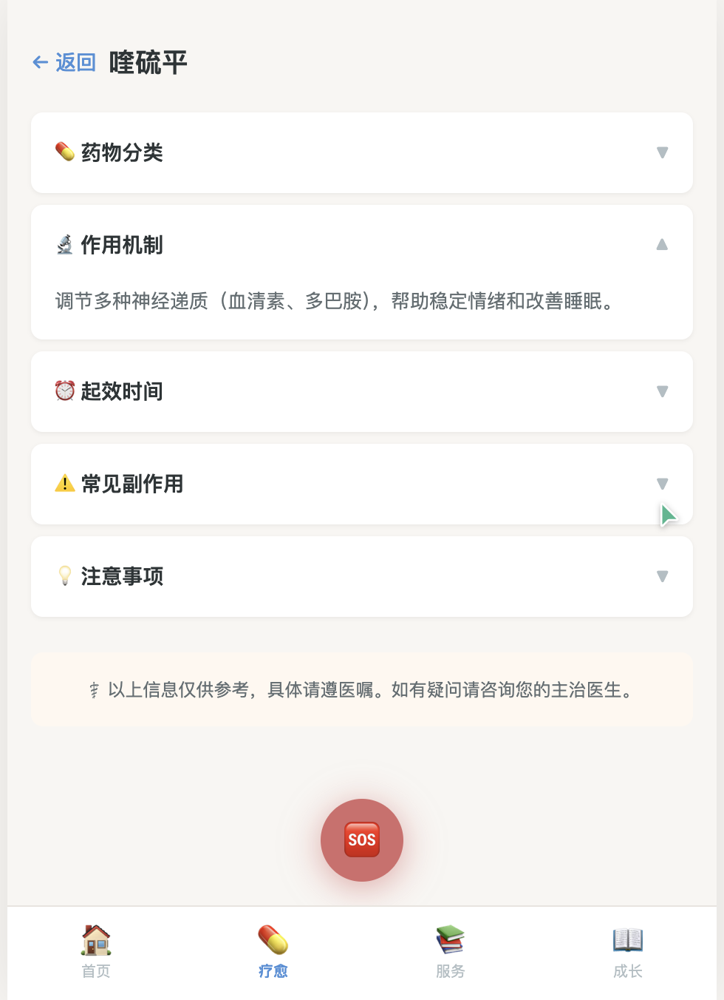

药物知识页面为您提供权威、易懂的药物科普信息。

**功能说明：**

该页面以结构化的方式展示药物的详细信息，包括**药物分类**（如SSRI、SNRI等）、**作用机制**（药物如何在体内发挥作用）、**起效时间**（通常需要2-6周）、常见**副作用**及**注意事项**。所有内容均基于循证医学资料整理，帮助您更好地理解自己所服用的药物，减少因未知带来的焦虑。

**操作步骤：**

1. 在用药管理页面点击目标药物条目。
2. 进入药物详情页，浏览各项药物知识。
3. 可重点查看"起效时间"和"注意事项"部分。

---

#### 3.4.2 副作用追踪

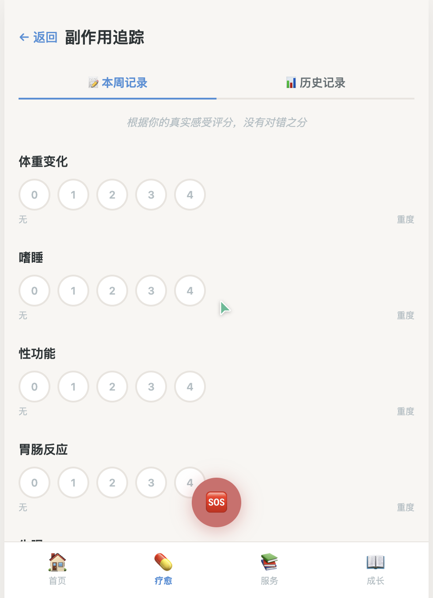

副作用追踪帮助您科学记录和管理药物可能产生的不良反应。

**功能说明：**

页面提供7项常见副作用的评分追踪，包括**体重变化、嗜睡、性功能影响、胃肠反应、失眠、食欲变化、焦虑**。每项副作用采用严重程度评分，您可以定期记录。系统会根据您的记录提供**循证应对策略**，例如针对嗜睡的建议调整服药时间、针对胃肠反应的建议随餐服用等。此外，页面支持生成**复诊报告**，方便您在就医时向医生展示副作用情况。

**操作步骤：**

1. 进入用药管理，选择"副作用追踪"。
2. 对各项副作用进行严重程度评分。
3. 查看系统提供的应对策略建议。
4. 复诊前点击"生成报告"，将副作用记录导出供医生参考。

---

#### 3.4.3 药物-情绪联动

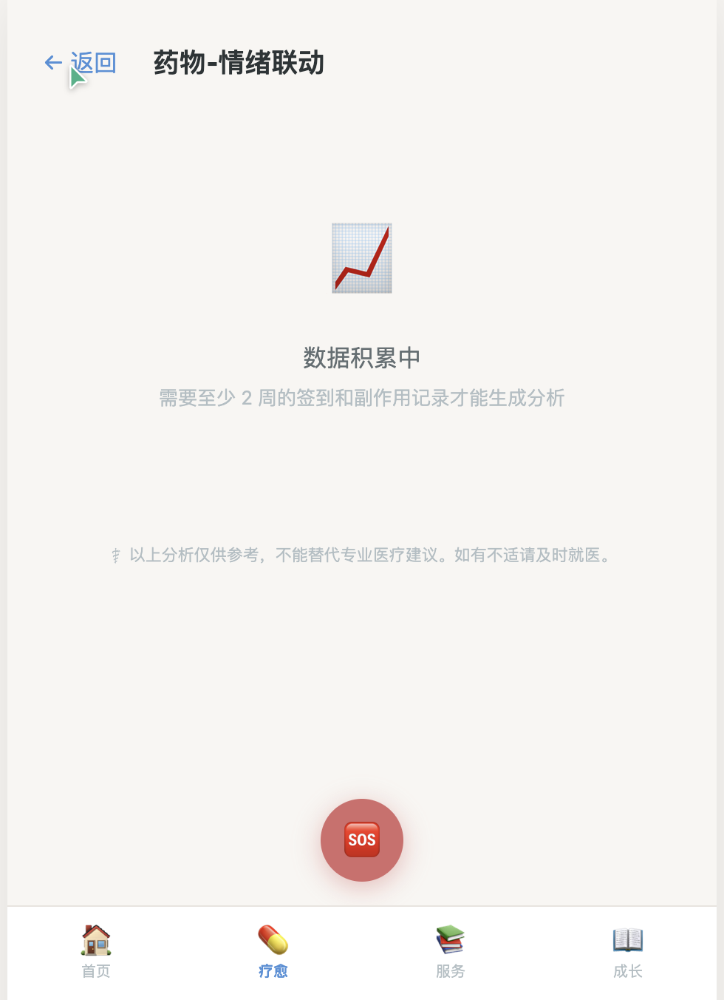

药物-情绪联动功能帮助您发现用药规律与情绪变化之间的关联。

**功能说明：**

该页面将您的**用药记录**与**每日签到中的情绪评分**进行关联分析，通过周趋势图表直观展示两者之间的关系。系统会自动生成**洞察报告**，例如"本周按时服药天数较多时，情绪评分平均高出0.8分"。这些数据可以帮助您和医生更好地评估药物疗效，增强坚持服药的信心。

**操作步骤：**

1. 在用药管理中选择"药物-情绪联动"。
2. 查看周趋势图表，了解情绪与服药的关联。
3. 阅读系统自动生成的洞察分析。
4. 可将分析结果截图保存，复诊时与医生讨论。

---

#### 3.4.4 减药导航

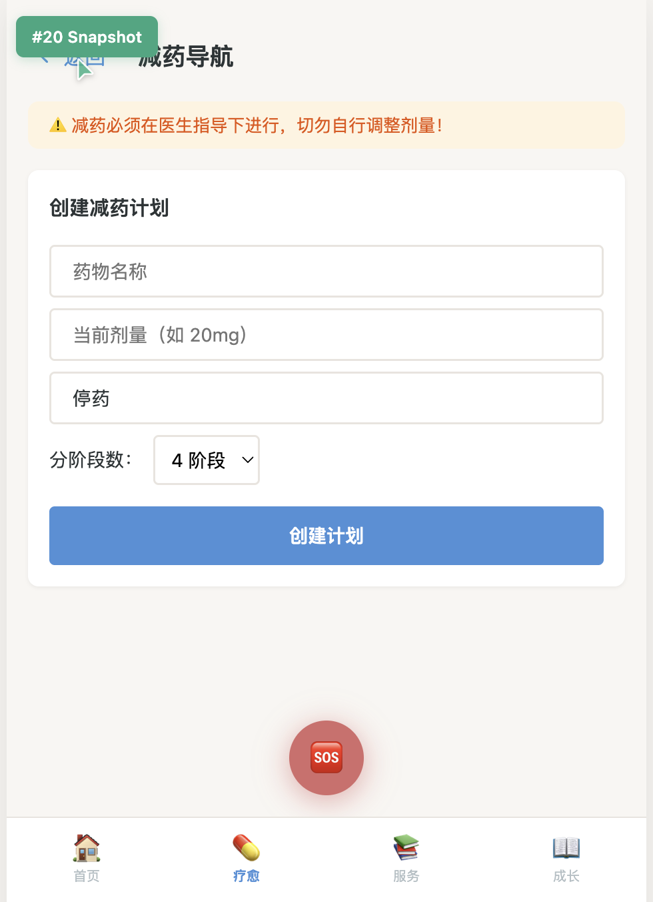

减药导航为需要在医生指导下逐步减少药物用量的用户提供系统化支持。

**功能说明：**

减药导航支持创建**分阶段减药计划**，您可以设置每个阶段的目标剂量和持续时间。系统会追踪您的减药进度，并在每个阶段提醒您记录身心状态。页面还提供**医生沟通报告生成**功能，将您的减药过程、症状变化等数据整理成报告，方便与医生沟通调整方案。

> **重要提示：减药、停药必须在专业医生的指导下进行，切勿自行调整药物剂量。** 突然停药可能导致严重的撤药症状。

**操作步骤：**

1. 在用药管理中选择"减药导航"。
2. 点击"创建减药计划"，按照医生建议设置各阶段目标。
3. 按计划执行，每日记录状态。
4. 复诊前生成医生沟通报告。

---

### 3.5 服务中心

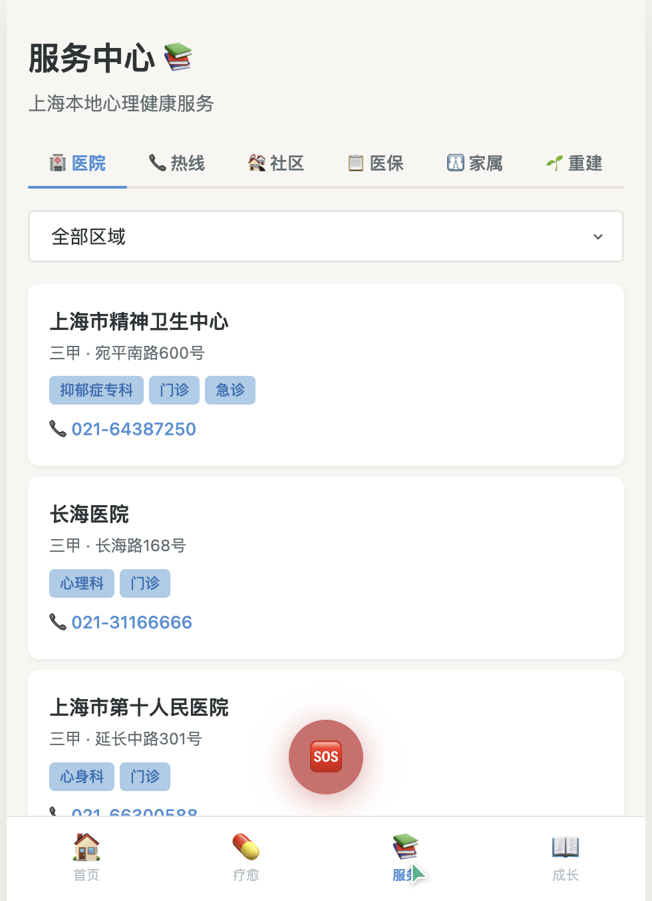

服务中心是申归途的资源聚合平台，为您提供多维度康复支持。

**功能说明：**

服务中心包含六个标签页，每个标签页聚焦一类康复资源：

| 标签页 | 内容说明 |
|--------|----------|
| **医院** | 精神科/心理科医院信息，支持按区域筛选 |
| **热线** | 心理援助热线、危机干预电话汇总 |
| **社区** | 线下互助小组、康复社区活动信息 |
| **医保** | 精神疾病医保政策、报销指南 |
| **家属** | 家属教育课程、照护者支持资源 |
| **重建** | 社交重建任务系统、康复故事分享 |

**操作步骤：**

1. 通过底部导航栏进入"服务"页面。
2. 点击顶部标签页切换不同资源类别。
3. 在"医院"标签页中，可按区域筛选查找附近的精神卫生机构。
4. 在"热线"标签页中，点击电话号码可直接拨打。

---

#### 3.5.1 家属支持

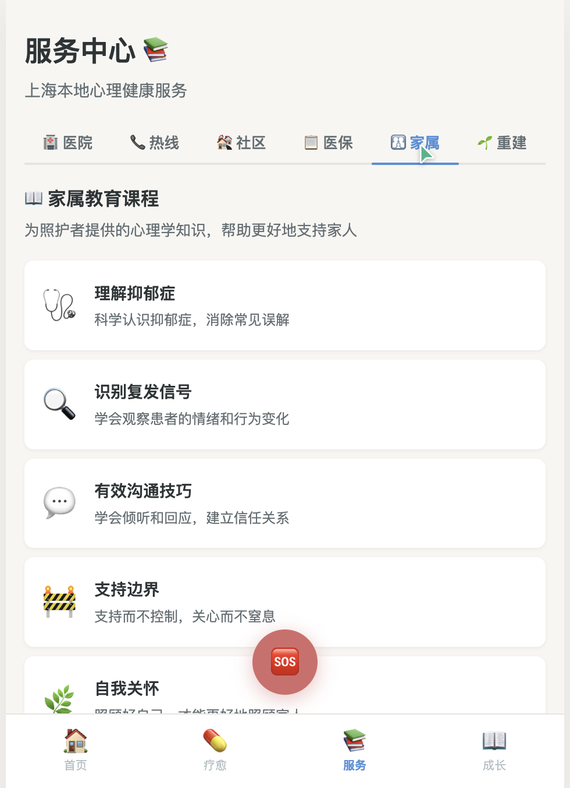

家属支持模块为抑郁症患者的家属和照护者提供专业指导。

**功能说明：**

该模块包含**家属教育课程**，帮助家属了解抑郁症的科学知识、正确的沟通方式和陪伴技巧。**行动指南**提供了具体的应对策略，例如当患者出现消极情绪时该如何回应。页面还设有**照护者压力自评**工具，帮助家属关注自身心理健康，以及**自我关怀清单**，提醒照护者在照顾他人的同时也要照顾好自己。

**操作步骤：**

1. 进入服务中心，切换至"家属"标签页。
2. 浏览家属教育课程，选择感兴趣的主题学习。
3. 查看行动指南，获取实用的沟通与陪伴技巧。
4. 定期完成照护者压力自评，关注自身状态。

---

#### 3.5.2 社会重建

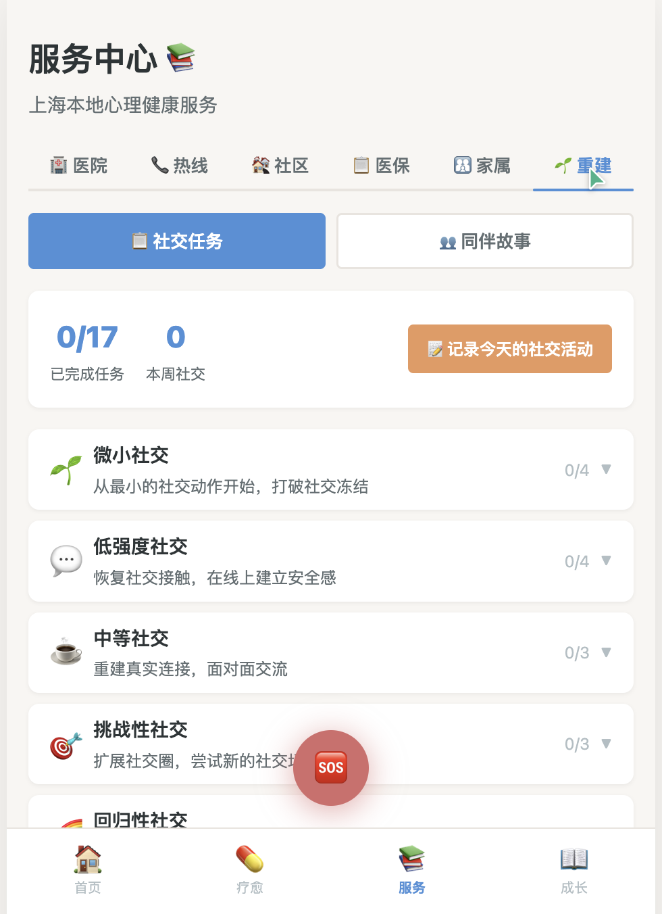

社会重建模块帮助您逐步恢复社交能力，重新融入社会生活。

**功能说明：**

该模块采用**分级社交任务系统**，将社交活动从易到难分为多个等级（如：线上聊天、与一位朋友见面、参加小型聚会等），您可以根据自身状态选择合适难度的任务。系统支持**每日社交活动记录**，帮助您追踪社交恢复进度。此外，页面还分享**同伴康复故事**，让您看到他人成功康复的经历，增强信心。

**操作步骤：**

1. 进入服务中心，切换至"重建"标签页。
2. 查看分级社交任务列表，选择适合当前状态的任务。
3. 完成社交活动后，在"每日记录"中打卡。
4. 浏览同伴康复故事，获取力量与启发。

---

### 3.6 危机干预

危机干预页面是申归途的安全网，在您最需要帮助时提供即时支持。

**功能说明：**

危机干预页面提供**一键拨打**功能，可直接连接心理援助热线或急救电话。页面内置**4-7-8呼吸放松法**引导练习——吸气4秒、屏息7秒、呼气8秒，帮助您在焦虑或恐慌时快速平复情绪。页面同时展示**安全提示**信息，提醒您当前状态虽然艰难，但会过去，并鼓励您寻求专业帮助。

**操作步骤：**

1. 在任何页面点击紧急求助按钮，或通过导航进入危机干预页面。
2. 如需立即通话，点击 **"拨打心理热线"** 或 **"拨打急救电话"**。
3. 如感到焦虑不安，点击 **"开始呼吸练习"**，跟随引导进行4-7-8呼吸放松。
4. 阅读页面上的安全提示文字，给自己一些时间。

---

### 3.7 心理干预课程

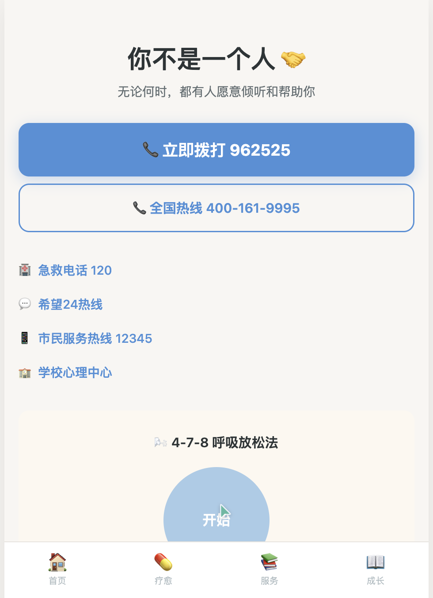

心理干预课程中心整合了四大循证疗法，支持系统化的自我学习。

**功能说明：**

课程中心涵盖四种经过科学验证的心理疗法：

- **CBT（认知行为疗法）**：帮助您识别和改变消极思维模式。
- **MBCT（正念认知疗法）**：结合正念练习与认知技术，预防抑郁复发。
- **WRAP（康复行动计划）**：系统化的自我管理工具，建立个人康复体系。
- **ACT（接纳承诺疗法）**：学习接纳负面情绪，专注于有价值的行动方向。

课程采用**分级学习**设计，从基础概念到高级技巧逐步深入。每个课程包含多个步骤，支持**进度追踪**，您可以随时继续未完成的学习。

**操作步骤：**

1. 通过底部导航栏进入"疗愈"页面。
2. 浏览四大疗法课程列表，选择适合的课程。
3. 点击课程名称，展开课程层级结构。
4. 选择当前学习步骤，进入课程内容页面。
5. 完成课程学习后，系统自动标记进度并解锁下一步。

---

### 3.8 WRAP康复计划

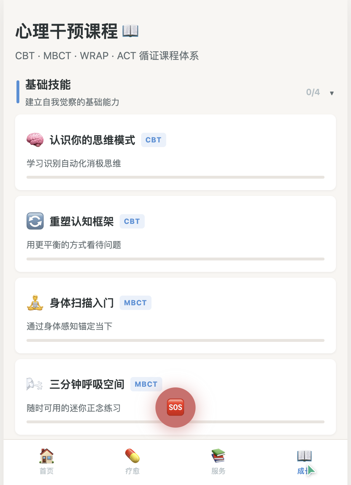

WRAP康复计划编辑器帮助您建立系统化、个性化的自我管理方案。

**功能说明：**

WRAP（Wellness Recovery Action Plan）是一种国际公认的心理康复自助工具。申归途的WRAP编辑器包含五个核心板块：

| 板块 | 说明 |
|------|------|
| **日常维护工具** | 记录每天保持身心健康的日常活动和习惯 |
| **早期预警信号** | 识别状态可能下滑的早期迹象 |
| **应对策略** | 当预警信号出现时可以采取的具体行动 |
| **危机应对方案** | 在严重危机时的紧急联系人和处理步骤 |
| **康复后维持计划** | 状态恢复后如何巩固成果、防止再次恶化 |

每个板块支持添加、编辑和删除条目，所有修改**自动保存**，无需手动保存操作。

**操作步骤：**

1. 通过底部导航栏进入"成长"页面，或从仪表盘点击WRAP入口。
2. 浏览五个板块，点击板块标题可**展开/折叠**内容。
3. 点击 **"添加"** 按钮，输入新的条目内容。
4. 点击已有条目右侧的编辑图标，可修改内容。
5. 点击删除图标可移除不需要的条目。
6. 所有操作自动保存，关闭页面后数据不会丢失。

---

## 4. 常见问题（FAQ）

### 数据存储在哪里？

申归途的所有数据均存储在您设备的**本地浏览器 localStorage** 中，不会上传至任何云端服务器。这意味着您的隐私数据完全由您自己掌控，但同时也请注意：清除浏览器数据会导致应用数据丢失。

### 如何重置数据？

如果您需要重置应用数据，可以通过以下方式操作：

1. 打开浏览器开发者工具（通常按 F12 键）。
2. 进入"应用程序"（Application）标签页。
3. 在左侧找到"本地存储"（Local Storage）。
4. 找到申归途相关的存储条目并删除。

> **注意：重置操作不可逆，所有签到记录、药物信息和康复计划都将被清除。**

### 应用是否替代专业医疗？

**不能。** 申归途是一款辅助支持工具，旨在帮助您更好地进行自我管理和康复追踪，但绝不能替代专业医生的诊断和治疗。任何关于药物调整、治疗方案变更的决定，都必须在专业医生的指导下进行。

### 忘记签到怎么办？

不必担心偶尔的遗漏。您可以在之后补填前一天的签到记录。康复是一个长期的过程，偶尔一天未签到不会影响整体趋势分析。重要的是保持长期记录的习惯。

### 如何联系开发者？

如果您有功能建议、问题反馈或合作需求，可以通过以下方式联系开发团队：

- 在应用内通过"关于"页面查看联系方式
- 发送邮件至开发团队邮箱（详见应用"关于"页面）

---

## 5. 紧急联系信息

如果您或您身边的人正处于危机状态，请立即拨打以下电话寻求帮助：

| 服务名称 | 电话号码 | 服务时间 |
|----------|----------|----------|
| 上海心理热线 | **962525** | 24小时 |
| 全国心理援助热线 | **400-161-9995** | 24小时 |
| 希望24热线 | **400-161-9995** | 24小时 |
| 急救电话 | **120** | 24小时 |
| 市民服务热线 | **12345** | 24小时 |

> **您并不孤单。** 无论何时何地，都有人愿意倾听和帮助您。拨打热线并不丢人，寻求帮助是勇敢且明智的选择。

---

*申归途 - 陪伴您重返归途*
