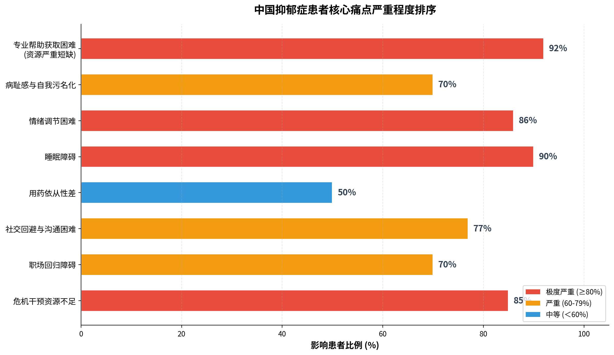
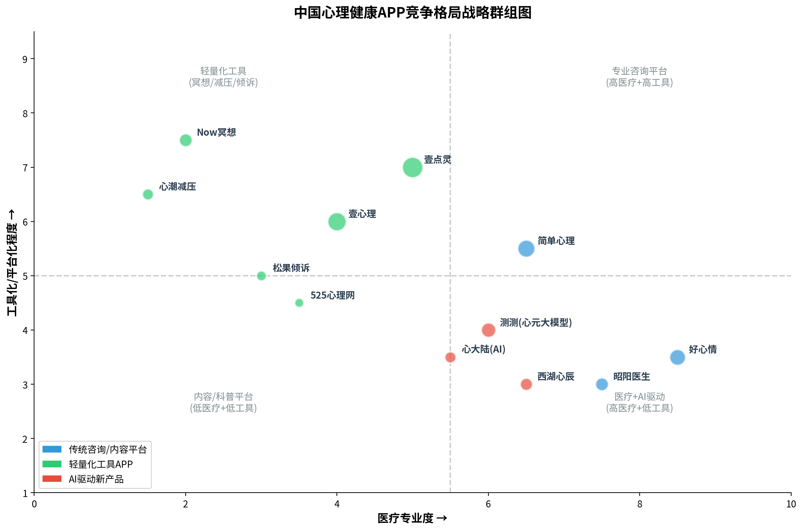
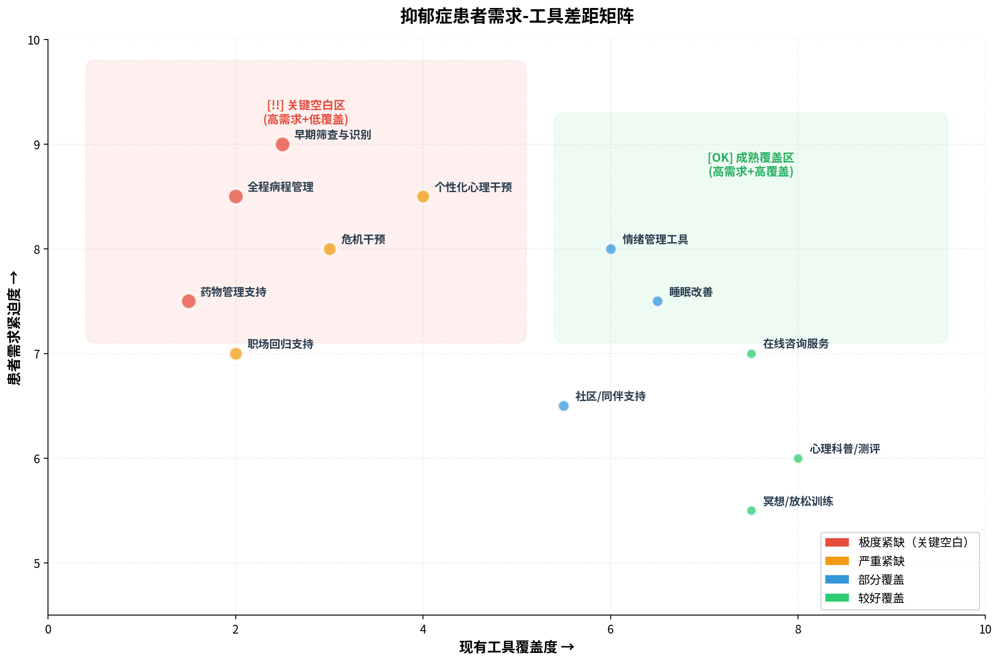
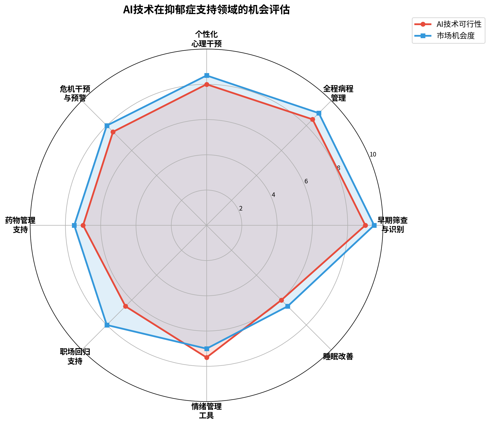

# 抑郁症患者需求与线上心理健康APP工具现状分析报告

## Abstract

中国抑郁症患者规模已接近**9,500万人**，但就诊率不足30%，充分治疗率不足1%。本报告基于流行病学数据、行业调研和竞品分析，系统梳理了抑郁症患者的八大核心痛点、现有线上心理健康APP工具的功能覆盖现状，以及需求与工具之间的关键差距。研究发现：**早期筛查识别、全程病程管理、药物管理支持和危机干预**是现有工具覆盖最薄弱、患者需求最迫切的四大领域。AI技术（特别是专精化心理大模型、多模态情绪监测和数字疗法）在填补这些空白方面展现出巨大潜力，但当前行业整体仍处于从"情绪陪伴"到"循证治疗"的跨越期。本报告为面向抑郁症患者的AI工具设计提供了数据驱动的方向指引。

---

## 1. 引言

### 1.1 研究背景

抑郁症已成为全球第二大疾病负担，在中国更是呈现出"高患病率、低就诊率、高未满足需求"的结构性矛盾。根据《柳叶刀-精神病学》发表的《中国精神卫生调查》，中国成人抑郁障碍终生患病率为**6.8%**，抑郁症患病率为**3.4%**，患者总数约**9,500万人**。与此同时，精神卫生专业人才极度匮乏——全国精神科医生仅约**6.4万人**，每十万人口不足4人，远低于高收入国家的10人以上标准。

在此背景下，线上心理健康工具和AI技术被寄予厚望，成为缓解供需矛盾的重要手段。2025年中国心理健康数字服务市场规模已突破**200亿元**，用户规模超**1.5亿**，年增长率超过25%。然而，工具供给与患者真实需求之间是否存在系统性错配，尚未有充分的研究梳理。

### 1.2 研究目标与方法

本报告旨在回答三个核心问题：
1. 中国抑郁症患者面临的最大未满足需求是什么？
2. 现有线上心理健康APP工具的功能覆盖情况如何？
3. 需求与工具之间的关键差距在哪里？AI技术能填补哪些空白？

研究方法涵盖：文献综述（学术论文、行业蓝皮书、政府统计）、竞品分析（主流APP功能对比）、政策分析（国家及地方政策文件）和趋势研判（AI技术发展路线）。

### 1.3 数据来源

本报告数据主要来源于：《柳叶刀-精神病学》（北京大学第六医院黄悦勤教授团队）、《2022-2023年国民抑郁症蓝皮书》、《中国国民心理健康发展报告(2023-2024)》（中科院心理研究所）、《中国抑郁障碍防治指南(2025版)》、贝哲斯咨询行业报告、法治日报调查报道等权威来源。

---

## 2. 抑郁症患者需求全景分析

### 2.1 流行病学基础：一个被低估的"隐形流行病"

中国抑郁症的流行病学数据揭示了问题的严峻性。不同权威来源的患病率数据虽存在口径差异，但指向同一结论——抑郁症已成为影响数千万中国人的重大公共卫生挑战。

| 指标 | 数据 | 来源 |
|------|------|------|
| 成人抑郁障碍终生患病率 | **6.8%** | 《柳叶刀-精神病学》2021 |
| 抑郁症患者总数 | **约9,500万人** | 多来源一致数据 |
| 就诊率 | **9.5%-30%** | 行业综合数据 |
| 充分治疗率 | **不足1%** | 北京安定医院 |
| 症状出现到首次就医延迟 | **平均2.1年** | 行业综合数据 |
| 每年自杀人数 | **约28万人**（40%患抑郁症） | 国民抑郁症蓝皮书 |

重点人群分布呈现明显的结构性特征：**18岁以下患者占总人数的30.28%**（超过2,800万人），**50%的抑郁症患者为在校学生**；女性占比**68%**，患病率约为男性的2倍；职场人群抑郁风险检出率为**10.6%**，互联网行业高达**27%**。

### 2.2 八大核心痛点：从生存需求到自我实现的多维困境

基于Maslow需求层次理论和JTBD（待完成任务）框架，我们将抑郁症患者的核心需求分解为八大痛点，按影响患者比例排序如下：

**痛点一：专业帮助获取困难（影响约92%的患者）**

这是最根本的结构性痛点。中国精神卫生资源极度短缺：精神科医生仅6.4万人，心理咨询师不足3万人（按国际标准缺口达130万以上），80%的综合医院没有精神科。大型三甲精神专科医院号源极度紧张，"一周的号一晚抢完"，30%的患者就诊/复诊需花费一整天时间。患者从症状出现到首次就医的平均延迟时间高达**2.1年**，超过80%的患者首次在综合医院就诊，但识别率不足20%。

**痛点二：睡眠障碍（约90%的患者伴随）**

WHO数据显示约90%的抑郁症患者伴有睡眠障碍，约40%的失眠患者会发展为抑郁症。睡眠障碍可使抑郁发生风险增加2-3倍，形成"失眠→焦虑→抑郁→更严重失眠"的恶性循环。典型表现为入睡困难、凌晨早醒和睡眠质量差，但目前针对抑郁症共病失眠的整合治疗方案严重不足。

**痛点三：情绪调节困难（86%的患者认为情绪压力是首要原因）**

患者长期处于情绪低落、兴趣丧失、自我价值感低落的状态中，缺乏有效的自我调节工具。青少年患者中，77%在人际关系中易出现抑郁，69%在家庭关系中易出现抑郁。患者常陷入"自责循环"——暗自责备自己不努力，同时又缺乏行动力，逐渐陷入恶性循环。

**痛点四：病耻感与自我污名化（70%的患者因歧视隐瞒病情）**

病耻感是阻碍患者就医和坚持治疗的最大心理障碍。心理问题被贴上"脆弱""能力差"标签，导致小病拖成重症。部分家属对产后抑郁患者处于漠视状态（40%），甚至认为是在"矫情"（13%）。患者内化了社会偏见，产生强烈的自我否定和羞耻感，形成"不敢说→不敢治→病情加重→更不敢说"的恶性循环。

**痛点五：社交回避与沟通困难（77%的学生患者在人际关系中易出现抑郁）**

抑郁症患者普遍出现社交回避、人际退缩，而社会支持系统的缺失进一步加重病情。城市化与独居化让传统家族支持瓦解，独居青年、空巢职场人缺乏情感缓冲。社会对抑郁症的误解导致人际交往中的"二次伤害"——被指责"心理脆弱""玻璃心"。中国缺乏系统化的同伴支持平台。

**痛点六：用药依从性差（约50%的患者存在服药依从性问题）**

药物治疗是抑郁症的基础治疗手段，但依从性差导致高复发率（50%-85%）。47%的患者对所服药品不够了解，仅9%了解减药方法。依从性差的主要原因包括：药物副作用（44%患者难以忍受体重增加）、病耻感、经济压力和认知偏差（症状缓解后自行停药）。

**痛点七：职场回归障碍（70%患者因歧视隐瞒病情）**

86%的中国公司没有给员工提供心理援助服务（EAP）。患者回归职场后面临工作能力被质疑、同事关系紧张、复发恐惧和工作节奏适应困难等多重障碍。2025年国家卫健委将"职业性精神和行为障碍"纳入新版《职业病分类和目录》，但配套支持体系尚未建立。

**痛点八：危机干预资源不足（全国仅20多个危机干预中心）**

中国每年约28万人自杀，其中40%患有抑郁症。全国24小时危机干预热线仅希望24热线等少数几条，全国仅有约2,000名危机干预志愿者。校园危机干预体系尤其薄弱，70%学校存在"心理筛查不精准""危机预警不及时"问题。

### 2.3 患者就医旅程：一个充满断点的迷宫

中国抑郁症患者的典型就医旅程揭示了系统性的服务断裂：

**第一阶段：症状出现与否认期**（平均持续数月至数年）——患者出现情绪低落、失眠等症状，多数不认为"患病"，将症状归因于"心情不好""压力太大"。

**第二阶段：辗转求医与误诊期**——超过80%的患者首次在综合医院就诊，但识别率不足20%，超过60%需二次转诊。

**第三阶段：确诊与治疗启动**——药物需2-4周才能起效，这段时间对患者尤为艰难。52%的患者因费用高不考虑心理治疗。

**第四阶段：治疗维持与依从性挑战**——约50%患者存在服药依从性问题，复发率高达50%-85%。

**第五阶段：康复与回归社会**——面临职场歧视、社交回避、家庭关系修复等挑战，缺乏系统的院外康复管理。

> **核心洞察**：抑郁症患者旅程中的每一个环节都存在"断点"——从识别延迟到误诊漏诊，从药物起效空窗期到依从性管理缺失，从出院后的"断崖式"支持缺失到职场回归障碍。这些断点构成了一个系统性的"服务真空带"，而现有工具对这一真空带的覆盖极为有限。

---

## 3. 线上心理健康APP工具竞争格局

### 3.1 市场概览：快速增长但高度分散

中国心理健康数字服务市场正处于快速发展期。2024年心理健康软件市场规模达**43-50亿元**，2025年整体数字服务市场规模突破**200亿元**，用户规模超**1.5亿**，年增长率超过25%。预计到2030年，全球行为/心理健康软件市场规模将达**354亿元**（CAGR 13.64%）。

然而，市场高度分散，集中度低。2024年心理咨询企业注册量同比增长27.83%，但头部APP的用户渗透率仍有限，投融资整体处于早期阶段（A轮及之前），尚未出现绝对的行业霸主。

### 3.2 主流APP功能对比：同质化严重，专业深度不足

| APP | 核心功能 | AI能力 | 目标用户 | 用户规模 | 融资情况 |
|------|---------|--------|---------|---------|---------|
| **壹心理** | 心理咨询、测评、课程、社区 | 基础 | 心理亚健康人群 | 数千万注册 | B轮数千万元 |
| **壹点灵** | 即时倾诉、预约咨询、电台、课程 | 基础 | 大众心理健康 | 5,000万人次 | B轮2亿元 |
| **简单心理** | 线上咨询、课程、倾诉热线 | 基础评估 | 中高端用户 | 数百万 | 2亿元 |
| **好心情** | 在线咨询、抑郁数字干预、睡眠改善 | 数字干预 | 中重度患者 | 数百万 | 3亿元 |
| **测测** | 心理测评、AI陪伴、3D沙盘 | 心元大模型 | 18-35岁年轻人 | 3,500万 | 多轮 |
| **心大陆** | AI心理疏导、抑郁/焦虑评估 | AI机器人 | 泛心理人群 | — | — |
| **西湖心辰** | AI心理服务 | AI对话 | 泛心理人群 | — | 数亿元 |
| **Now冥想** | 冥想课程、助眠故事、睡眠监测 | 无 | 睡眠/减压需求 | 200万+ | — |
| **心潮减压** | 减压放松、呼吸训练、情绪宣泄 | 无 | 压力管理人群 | — | — |

### 3.3 功能覆盖评估：六大类别，三大空白

| 功能类别 | 覆盖情况 | 代表APP | 覆盖评级 |
|---------|---------|---------|---------|
| 在线咨询/治疗 | 几乎所有主流平台标配 | 壹心理、壹点灵、简单心理 | ★★★★☆ |
| 心理测评/科普 | 普遍覆盖，但专业度差异大 | 所有主流平台 | ★★★★☆ |
| 冥想/呼吸/放松 | 专门类APP覆盖好 | Now冥想、心潮减压 | ★★★★☆ |
| 社区/同伴支持 | 多数平台有社区功能 | 壹心理、壹点灵 | ★★★☆☆ |
| AI聊天/情绪陪伴 | 新兴领域，快速崛起 | 测测、心大陆、西湖心辰 | ★★☆☆☆ |
| 危机干预/热线 | 覆盖极为薄弱 | 简单心理（倾诉热线） | ★☆☆☆☆ |
| 药物管理 | 极少覆盖 | 好心情（部分覆盖） | ★☆☆☆☆ |
| 全程病程管理 | 几乎空白 | 望里暖阳（医疗机构端） | ★☆☆☆☆ |

### 3.4 用户满意度与行业痛点

根据《法治日报》2025年调查报道，线上心理咨询相关投诉近**万条**，核心问题包括：

**咨询师资质混乱**：2017年人社部取消心理咨询师职业资格认证后，行业陷入"无门槛"状态。据武志红推算，国内合格的心理咨询师不超过**3,000人**，而持证咨询师达90多万，90%以上未从事该行业。

**价格高昂且不透明**：心理咨询平均单价约**400元/次**，月花费约**1,600元**，而居民人均月可支配收入仅**2,561元**。有用户支付9,800元后，咨询变成"理论复述和课程推销"。

**匹配效率低**：**65%用户**因"咨询师资质难辨""服务匹配差"放弃咨询。首次匹配失败往往意味着用户直接流失。

**隐私安全风险**：部分平台将用户咨询经历当作宣传素材，几块钱就能线上"确诊"抑郁症的测试工具可能泄露隐私数据。

> **核心洞察**：现有心理健康APP行业面临"三高一低"的结构性困境——**高同质化**（功能集中在咨询匹配和内容科普）、**高投诉率**（资质混乱、价格不透明）、**高流失率**（匹配效率低、效果难评估）vs **低专业深度**（对确诊抑郁症患者的全程管理能力严重不足）。行业本质上仍是一个"流量+中介"模式，而非"医疗+干预"模式。

---

## 4. 需求-工具差距分析与AI机会评估

### 4.1 差距矩阵：四大关键空白

通过将患者需求紧迫度与现有工具覆盖度进行交叉分析，可以清晰识别出四大"关键空白区"：

| 差距领域 | 需求紧迫度 | 现有覆盖度 | 差距评级 | 核心缺失 |
|---------|-----------|-----------|---------|---------|
| **早期筛查与识别** | 极高（就诊率不足30%） | 极低（仅量表自测） | 极度紧缺 | 缺乏AI驱动的主动筛查和风险预警 |
| **全程病程管理** | 极高（复发率50-85%） | 极低（出院即断联） | 极度紧缺 | 缺乏"筛查-治疗-随访-预防"闭环 |
| **药物管理支持** | 高（50%依从性差） | 极低（几乎空白） | 极度紧缺 | 缺乏服药提醒、副作用记录、药物-情绪关联分析 |
| **危机干预** | 高（28万/年自杀） | 低（仅20多个中心） | 严重紧缺 | 缺乏实时风险评估和分级干预流程 |
| **个性化心理干预** | 高（充分治疗率<1%） | 中低（标准化课程为主） | 严重紧缺 | 缺乏"千人千方"的精准干预方案 |
| **职场回归支持** | 中高（70%隐瞒病情） | 极低 | 严重紧缺 | 缺乏渐进式复工和职场心理支持方案 |

### 4.2 AI技术机会评估

基于技术可行性、政策支持和市场需求的综合评估，AI技术在以下方向展现出最大的填补潜力：

**方向一：AI驱动的早期筛查与风险预警（可行性9.0 / 市场机会9.5）**

这是当前最成熟、最迫切的AI应用方向。天津团队基于生态瞬时评估(EMA)和语音特征的抑郁识别模型准确率达**90%**；AI校园心理监测系统准确率达**95%**；语音情绪分析可将预警提前至**30天**左右；树洞救援AI系统已实现**5,700多次救援**。13.5%的年轻人更倾向于向AI倾诉心事，超过向父母亲人倾诉的比例。

**方向二：AI全程病程管理（可行性8.5 / 市场机会9.0）**

望里暖阳WL-iCBT已获批国内首个抗抑郁数字疗法三类医疗器械证，融合CBT、ACT、PPT、CBM等多维度心理治疗方法，推荐治疗周期8周，已被《中国抑郁障碍防治指南(2025版)》推荐为**1A级治疗手段**。其"宏观-中观-微观"三级推荐引擎实现了"千人千方"精准干预，依托30万真实世界患者数据库。

**方向三：AI个性化心理干预（可行性8.0 / 市场机会8.5）**

测测App的"心元大模型"是情感疏导与陪伴领域唯一获批大模型，中山大学"逸心"大模型锚定"课程教学+咨询辅导"核心功能。但通用大模型在心理健康领域仍存在"共情不足、专业度欠缺、无法应对复杂心理场景"等问题，专精化心理大模型是核心突破方向。

**方向四：AI危机干预与预警（可行性7.5 / 市场机会8.0）**

多模态融合技术（文本+语音+视觉+生理数据）正在快速发展，华为Watch GT5系列已集成情绪健康助手功能。但AI对重度抑郁、自杀风险的识别和干预能力仍有限，需要"AI初筛+人工介入"的分层干预模式。

### 4.3 政策环境：前所未有的红利窗口

2024-2025年，中国心理健康领域的政策环境发生了里程碑式变化：

| 政策/事件 | 时间 | 核心影响 |
|----------|------|---------|
| 《中国抑郁障碍防治指南(2025版)》发布 | 2024年9月 | 首次纳入AI认知行为疗法和数字疗法，推荐经认证的DTx产品 |
| 教育部AI心理助手新政 | 2025年 | 支持地方探索开发"AI心理助手""智能减压室" |
| 海南数字疗法支付政策 | 2023-2025年 | 全球首个数字疗法全周期支持政策 |
| 望里暖阳获批三类医疗器械证 | 2025年底 | 国内首个抗抑郁数字疗法产品，1A级推荐 |
| 《职业病分类和目录》更新 | 2025年 | "职业性精神和行为障碍"首次纳入 |
| 远程医疗服务覆盖率达50%以上 | 2025年目标 | "十四五"数字健康发展规划 |

> **核心洞察**：2024-2025年是中国AI心理健康领域的"政策拐点"。《中国抑郁障碍防治指南(2025版)》首次将AI和数字疗法纳入国家级诊疗指南，海南率先建立数字疗法支付政策，望里暖阳获批首张三类证——这些信号共同指向一个结论：**AI驱动的抑郁症数字干预已从"技术探索"正式进入"临床认可+政策支持+商业化落地"的三重驱动阶段**。对于参赛者而言，这是一个前所未有的窗口期。

---

## 5. 结论

中国抑郁症患者面临的核心困境可以概括为**"三低三高"**——**低就诊率、低识别率、低充分治疗率** vs **高病耻感、高复发率、高未满足需求**。9,500万患者中，就诊率不足30%，充分治疗率不足1%，从症状出现到首次就医平均延迟2.1年。精神科医生仅6.4万人，心理咨询师缺口超130万，供需矛盾极为尖锐。

现有线上心理健康APP虽然数量众多、市场快速增长（2025年规模突破200亿元），但功能高度同质化——集中在咨询匹配和内容科普两大模块，对确诊抑郁症患者的**全程病程管理、药物管理、危机干预和职场回归支持**几乎空白。行业本质上仍是"流量+中介"模式，咨询师资质混乱、价格高昂、匹配效率低、效果难评估等痛点突出。

AI技术在**早期筛查与风险预警、全程病程管理、个性化心理干预和分层危机干预**四个方向展现出最大的填补潜力。2024-2025年的政策拐点——《中国抑郁障碍防治指南(2025版)》首次纳入AI和数字疗法、海南数字疗法支付政策先行先试、望里暖阳获批首张三类证——为AI驱动的抑郁症支持工具创造了前所未有的落地条件。

对于面向命题一的参赛者而言，最关键的设计方向是：**不要做又一个"心理咨询匹配平台"，而应聚焦现有工具覆盖最薄弱、患者需求最迫切的"关键空白区"——用AI技术填补从"筛查"到"全程管理"的服务真空带。**

---

## 6. 参考文献

[1] Huang Y, Wang Y, Wang H, et al. Prevalence of mental disorders in China: a cross-sectional epidemiological study[J]. The Lancet Psychiatry, 2019, 6(3): 211-224.

[2] 抑郁研究所, 人民日报健康客户端. 2022-2023年国民抑郁症蓝皮书[R]. 2023.

[3] 中国科学院心理研究所. 中国国民心理健康发展报告(2023-2024)[R]. 2024.

[4] 中华医学会精神医学分会. 中国抑郁障碍防治指南(2025版)[S]. 2024.

[5] 贝哲斯咨询. 行为或心理健康软件行业2025报告[R]. 2025.

[6] 法治日报. 线上心理咨询乱象调查[N/OL]. 2025.

[7] 望里科技. 望里暖阳WL-iCBT产品资料[EB/OL]. 2025.

[8] 教育部. 全面加强和改进新时代学生心理健康工作专项行动计划(2023-2025年)[Z]. 2023.

[9] 海南省医保局, 海南省卫健委. 海南省数字疗法全周期支持措施[Z]. 2023.

[10] 复旦发展研究院. 中国青年网民社会心态调查报告(2024)[R]. 2024.

[11] 人人都是产品经理. 壹心理和壹点灵竞品分析[EB/OL]. https://www.woshipm.com/evaluating/4371322.html.

[12] 搜狐. 2025心理健康APP选择指南[EB/OL]. https://www.sohu.com/a/907128003_122444618.

[13] 新华网. AI赋能心理健康[EB/OL]. 2025.

[14] WHO. Mental health in China[EB/OL]. https://www.who.int/china/health-topics/mental-health.

[15] 头豹研究院. 中国心理咨询行业报告[R]. 2023.
